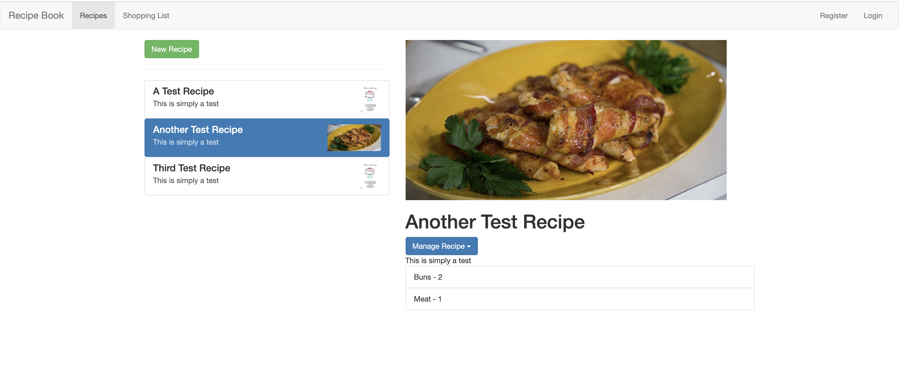

# Recipe Book
## Introduction
### Functions
* Sign up, Login and Logout -- Authentication
* Add Recipes, change Recipes
* Fetch and Store Recipes in back end
* Add and change ShoppingList
* Action Guard and Path Router
## Features
* Build with Angular
* Use Component for single page application
* Use Animation to demo small animation in the home page
* Use Directives for different page functions
* Use NgForm and ReactiveForm for form control
* Use Router for route to different urls
* Use Service for combine different functions
* Use Authentication for a dummy user login
* Use HttpClient for connecting with back end
* Use Google firebase for data persistence
* Use rxjs features like Observable and Subscribe the Subjects for Event Listening
* Use Guard for block users
* Use Pipes like async to handle Observable Object in template
* Use NgRx -- state control by reducers and actions in ngrx-store
## Demo

   

